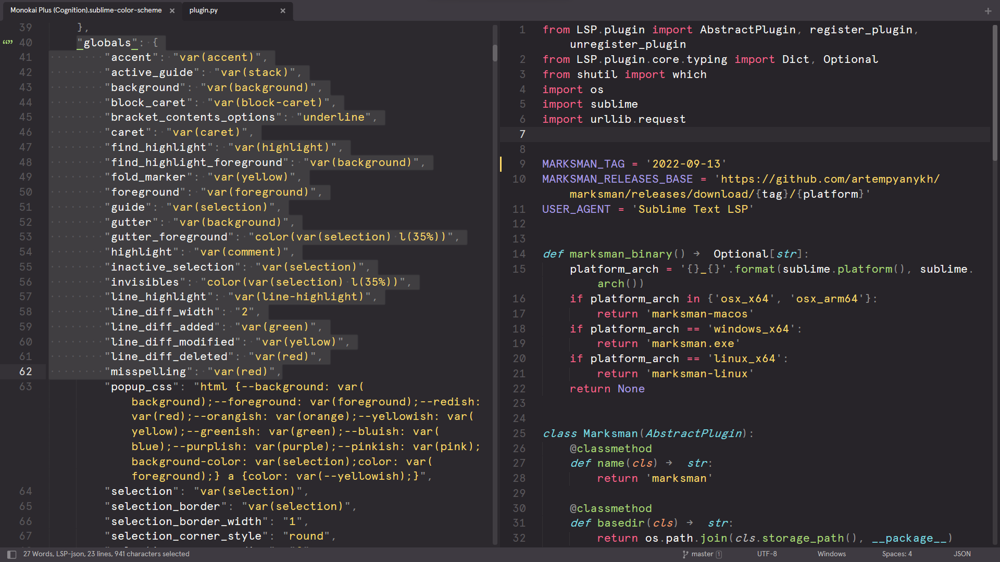

# Color Scheme - Monokai Plus

This is a Sublime Text (and Merge) color scheme using the [Monokai color palette](https://monokai.pro/sublime-text).
This implementation of Monokai uses the Sublime Text Mariana color scheme as a template with the Monokai color palette.

## Install

Git clone the project or download the project to your Sublime Text or Sublime Merge Packages folder as
`Monokai Color Scheme`. If you want to use it in both Sublime Merge and Sublime Text, you only have to install it in
Sublime Text as Sublime Merge will find the color schemes in Sublime Text.

For Sublime Text, edit your `Preferences.sublime-settings` file to use the Monokai theme:

```
    "color_scheme": "Packages/Monokai Color Scheme/Monokai Plus.sublime-color-scheme",
```

## Screenshots

Monokai Plus (Cognition)

")

Monokai Plus (Machine)

")

Monokai Plus (Octagon)

")

Monokai Plus



Monokai Plus (Ristretto)

")

Monokai Plus (Spectrum)

")

## Extra

Here is the repo of the [theme](https://github.com/bitsper2nd/merge-monokai-theme) for Sublime Merge. Also checkout my [other color scheme](https://github.com/bitsper2nd/sublime-mariana-scheme) based on the Mariana color palette.
